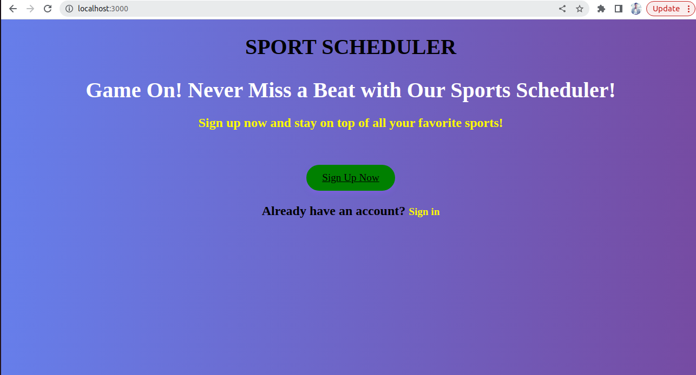
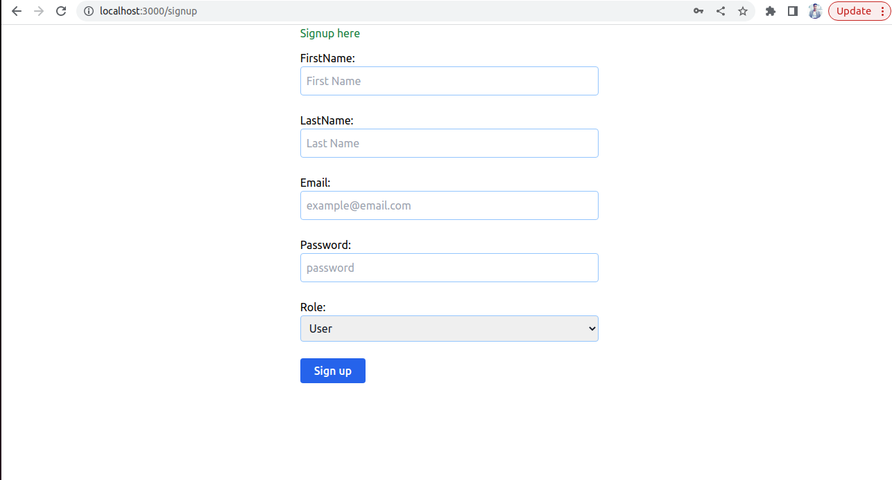
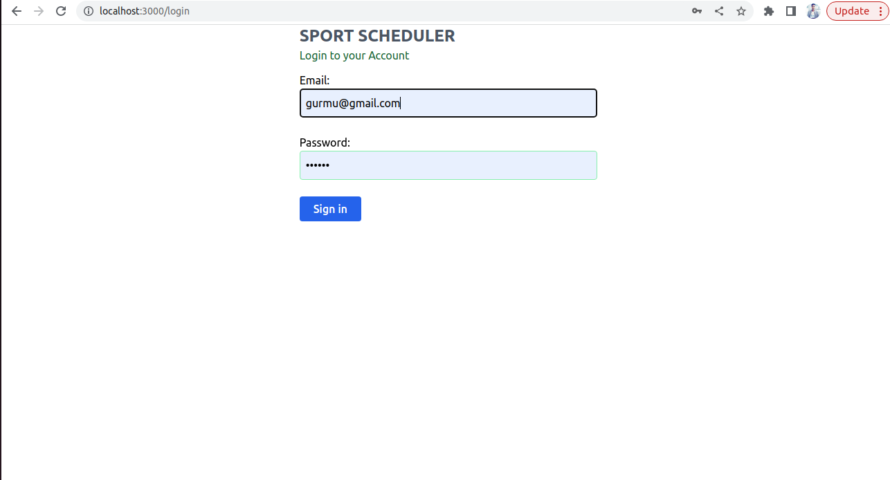
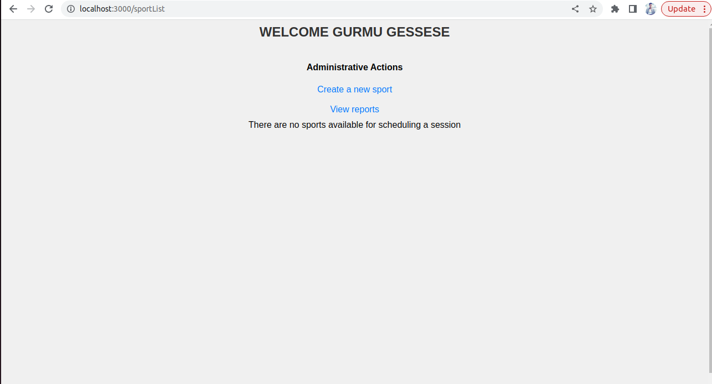
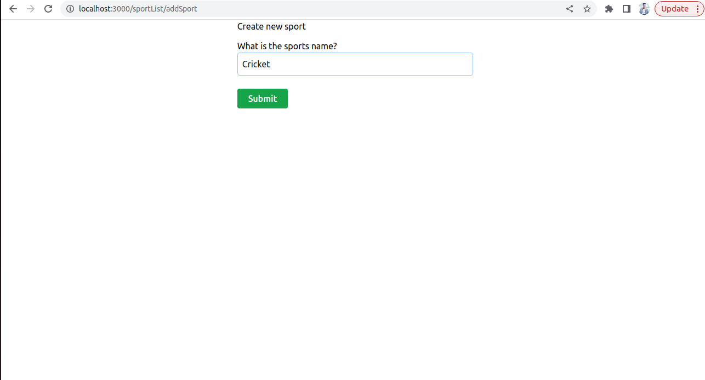
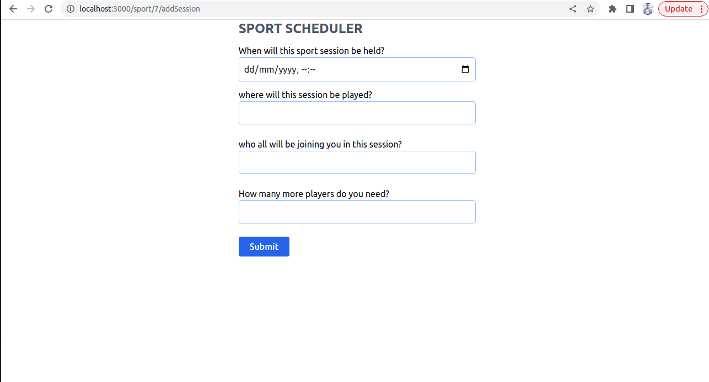
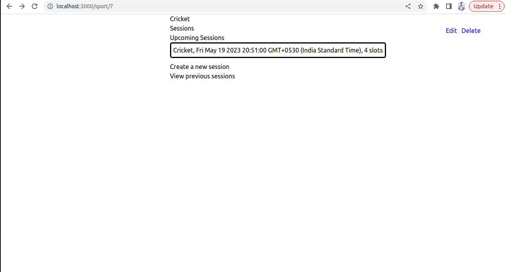
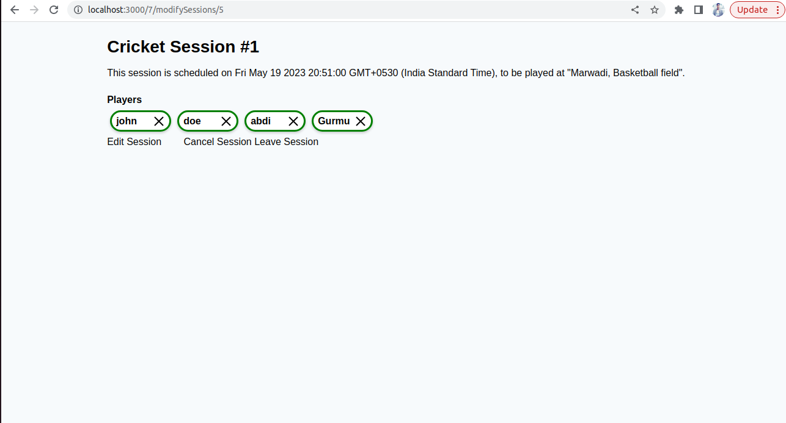
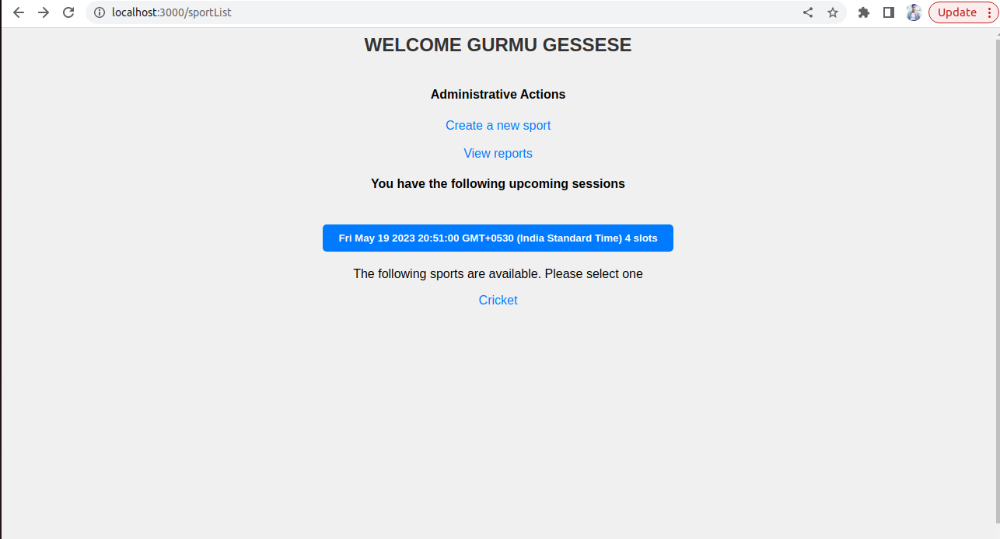

# wd201-sport-scheduler
Sport Scheduler
Welcome to Sport Scheduler, a web application designed to simplify sports scheduling and session management. This project provides a user-friendly platform that allows users to effortlessly create sessions, join sessions, and leave sessions as needed. With distinct user and admin personas, Sport Scheduler offers a comprehensive solution for both participants and organizers.

Features
Add Sports: Admins can easily add various sports to the platform, providing a diverse selection for scheduling sessions.

Create Sessions: The application allows users to create sessions for specific sports, including details such as location, date, time, and any additional information required.

Join Sessions: Users have the ability to browse and join sessions of their choice, enabling them to participate in their preferred sports and connect with like-minded individuals.

Leave Sessions: In case of any conflicts or changes in plans, users can effortlessly leave sessions they have previously joined, ensuring flexibility and convenience.

User and Admin Personas: Sport Scheduler offers distinct roles for users and administrators. Users can participate in sessions, while admins have additional privileges such as managing sports, sessions, and user accounts, and creating the sports.

Getting Started
To use Sport Scheduler, follow these steps:

Clone the repository: git clone https://github.com/gurmugt/wd201-sport-scheduler.git
Install the required dependencies by running npm install.
Configure the application settings, including database credentials and session management, by modifying the config.js file.
Run the application using npm start and access it via http://localhost:3000 in your web browser.

Technologies Used
Sport Scheduler is built using the following technologies:

Backend: Node.js, Express.js
Database: postgreSQL
Frontend: HTML, CSS, JavaScript
Authentication: Passport.js
Session Management: Express-session

Contact
For any inquiries or suggestions, please contact me at https://www.linkedin.com/in/gurmu-gessese-597153244

APPLICATIONS SCREENSHOT

Live URL on application
https://sport-scheduler-kwlf.onrender.com/

VIDEO SCREENCAST

Thank you for choosing Sport Scheduler. I hope you find it valuable in simplifying your sports scheduling and session management needs. Enjoy your sports activities and have a great time!
